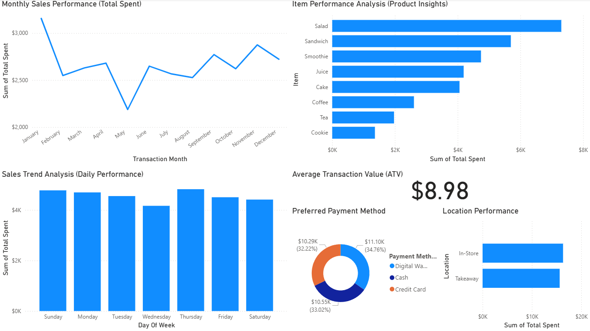
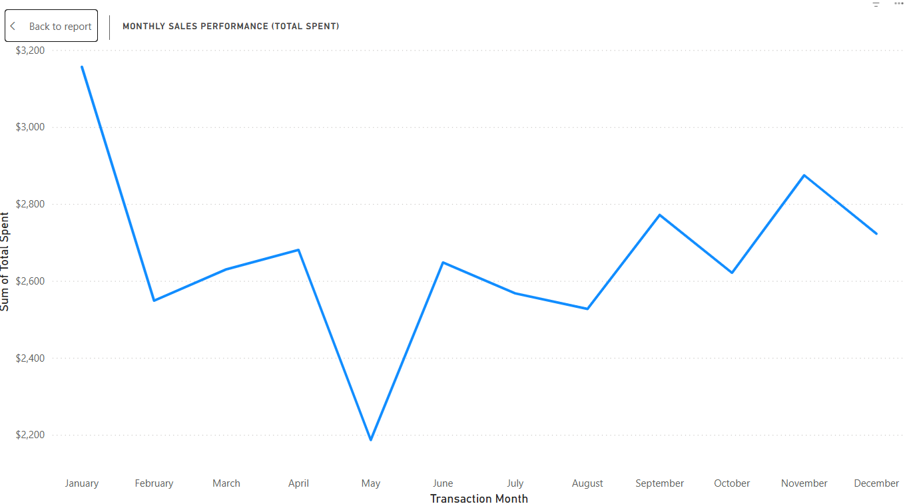
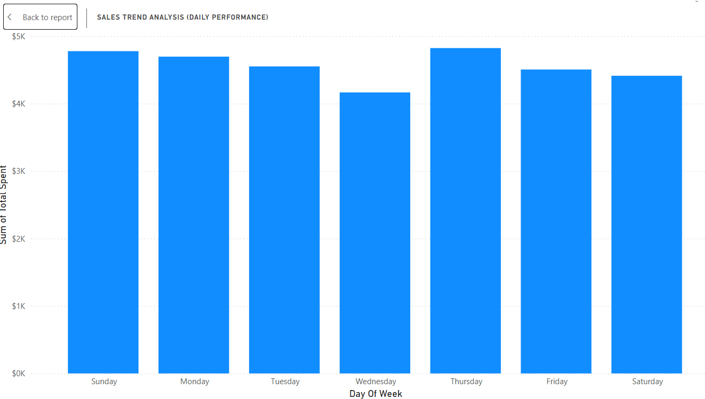
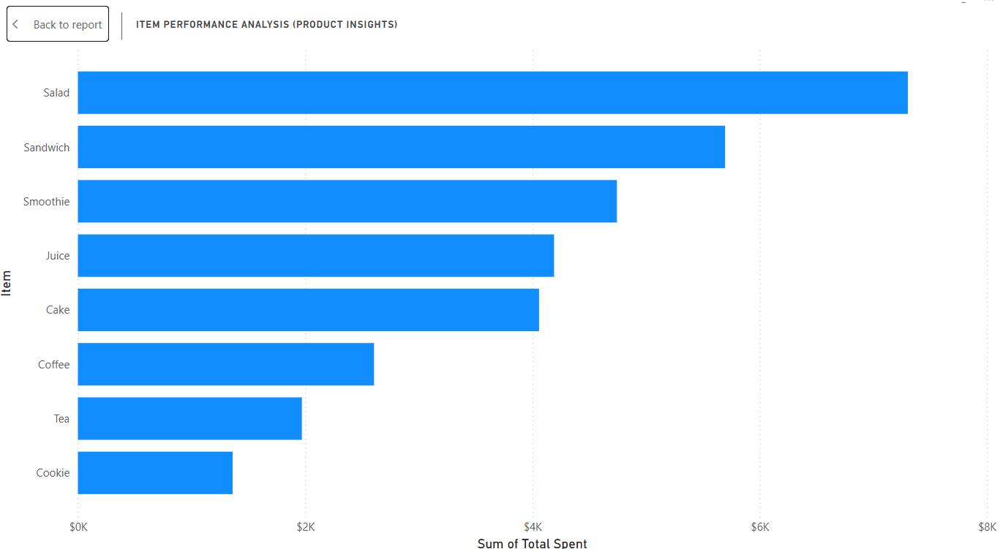
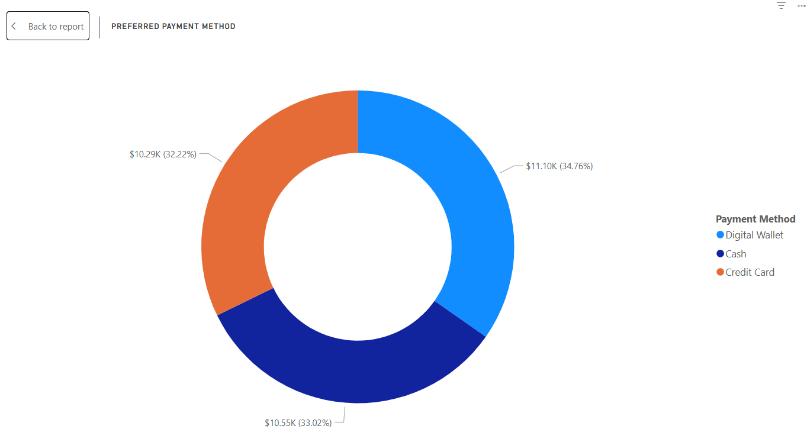
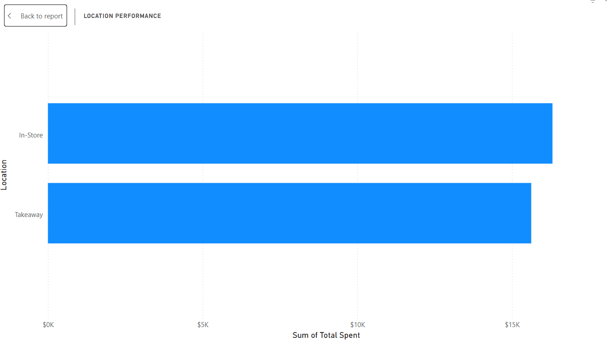

# ☕ Café Sales Performance & Customer Insights

## 📌 Project Overview
This project transforms raw, "dirty" sales records from a local café into actionable business intelligence. Using **Power BI** and **Power Query**, I cleaned inconsistent data, engineered new time-series features, and built an interactive dashboard to uncover sales trends, product performance, and customer behavior patterns.

The goal was to move beyond simple reporting to provide strategic recommendations for **inventory, staffing, and payment infrastructure**.

---

## 📂 Files in this Repository

| File Name | Description |
| :--- | :--- |
| **`Cafe_Sales_Insights.pbix`** | The complete Power BI project file (Data Cleaning + Dashboard). |
| **`dirty_cafe_sales.csv`** | The raw dataset used for this project. |
| **`dashboard_overview.png`** | Executive dashboard screenshot. |
| **`monthly_sales.png`** | Visualization: Seasonality & trends. |
| **`sales_trend.png`** | Visualization: Daily sales segmentation. |
| **`item_performance.png`** | Visualization: Product revenue ranking. |
| **`location_performance.png`** | Visualization: Sales by location. |
| **`preferred_payment.png`** | Visualization: Customer payment methods. |

---

## 🛑 The Business Problem
The café struggled with messy transaction data that made it impossible to track performance accurately.

* **Data Quality Issues:** Missing sales figures, inconsistent item names (e.g., "salad" vs "Salad"), and ambiguous date formats prevented analysis.
* **Operational Blind Spots:** Management didn't know their peak sales hours, revenue drivers, or payment preferences.

**Objective:** Clean the data to **100% validity** and visualize key metrics to optimize staffing schedules, inventory planning, and operational investments.

---

## 🛠️ The Solution: Data Cleaning & Transformation
All data transformation was performed using **Power Query** to ensure reproducibility.

### 1. Data Cleaning Strategy (Deductive Imputation)
Instead of dropping rows with missing values (which would lose 10%+ of the data), I used a deductive imputation strategy:
> **Formula:** `Total Spent = Quantity × Price Per Unit`

I calculated missing values for any column by leveraging the other two known variables, rescuing hundreds of transaction records.

### 2. Standardization & Quality Assurance
* **Text Cleaning:** Applied Trim, Clean, and Proper Case to standardize categorical columns like `Item` and `Location`.
* **Date Handling:** Converted inconsistent date formats and filtered out invalid timestamps.
* **Validation:** Achieved **100% Column Quality** (0 errors, 0 empty values) before loading data into the model.

### 3. Feature Engineering
* **Time Intelligence:** Created `Transaction Month` and `Day of Week` columns from the raw date field.
* **Sorting Logic:** Created hidden numerical sort columns (`Month Number`, `Day Number`) to ensure chronological sorting in visualizations.

---

## 📊 Key Insights & Visualizations

### 1. Sales Trends: Seasonality & Volatility
**Insight:** Sales are highly seasonal. The annual trough is in May, while peaks occur in January and November, indicating a strong late-year "seasonal rush."

**Daily Segmentation (Key Finding):**
* **Thursday** is the **Peak Revenue Day** (High Volume).
* **Tuesday** is the **Premium Customer Day** (Highest Average Transaction Value - ATV of $9.35).

**Action:** Maximize staffing on Thursdays for speed. Target Tuesdays for upselling premium items to high-value customers.

### 2. Product Performance
**Insight:** **Salad** is the #1 revenue-generating item. The top 3 items account for a disproportionate share of total revenue.

**Action:** Operational focus (inventory & quality control) must prioritize the Salad station to protect the primary revenue stream.

### 3. Customer Behavior: Payments & Location
**Insight:** **Digital Wallets** are the preferred payment method (34.76%), overtaking Cash and Credit Cards. Sales are evenly split between **In-Store** and **Takeaway**.

**Action:** Immediate investment in digital payment infrastructure is required to prevent transaction failures during peak times.

| Payment Preferences | Location Analysis |
| :---: | :---: |
|  |  |

---

## 📝 Technical Challenges & Learnings

* **Market Basket Analysis (MBA) Limitation:** I attempted to perform MBA to find product bundles. However, technical auditing revealed the dataset structure used single-item transactions (unique Transaction IDs for every item).
* **Pivot to ATV:** The finding above allowed me to pivot the analysis to **Average Transaction Value (ATV)** instead, providing a more relevant metric for this specific data structure to segment high-value customers (Tuesdays).

---

## 🔗 Data Source
* **Dataset:** Cafe Sales - Dirty Data for Cleaning Training (Kaggle)

## 👤 Author
**Abdullah Tariq**
[LinkedIn Profile](https://www.linkedin.com/in/syed-abdullah-tariq-ahmed-9a4a382ba/)